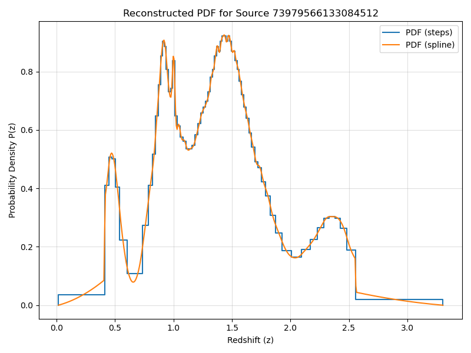
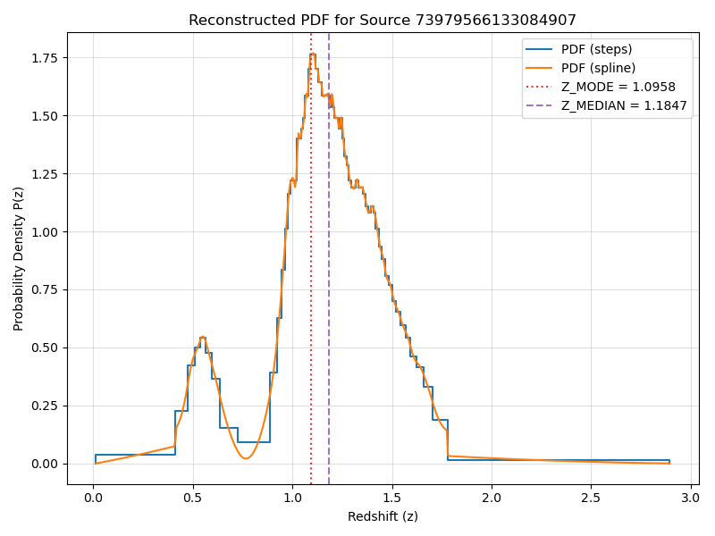

# ColdPress

[](https://www.gnu.org/licenses/gpl-3.0)

**A toolkit for compression and analysis of redshift PDFs**

The core of the **coldpress** python package is the *ColdPress* algorithm for fast and efficient compression of probability density functions (PDFs) in a compact, fixed-size encoding. This is ideal for efficient storage of millions of redshift PDFs in large astronomical databases.

*ColdPress* compression works by computing the redshifts {*z<sub>i</sub>* } that correspond to the *quantiles* {*q<sub>i</sub>* }
of the cumulative distribution function (CDF) and encoding the differences
*∆<sub>i</sub>* = *z<sub>i</sub> - z<sub>i-1</sub>* using (often) a single byte.

> [!NOTE] The details of the algorithm for encoding the quantiles as well as a performance comparison with alternative compression methods are presented in [this research note](https://journals.aas.org/research-note-preparation-guidelines).

The CDF is obtained via integration of the probability density *P*(*z*), which is represented in the input data by an array of floating point numbers. **coldpress** accepts two formats for *P*(*z*):

  1. the array contains the values of *P(z)* measured at regular intervals, from *z*<sub>min</sub> to *z*<sub>max</sub> in constant steps of *∆z*. This is the usual format of most SED-fitting photo-z codes. We call this a **binned PDF**. 
  2. the array contains random redshift values obtained by random sampling of the probability distribution *P(z)*. This is the natural output of photo-z codes that use Monte Carlo for error propagation of the photometric uncertainties. We call this a **PDF by random samples**.

With the CDF, **coldpress** can perform multiple tasks, including:

- generate a binned PDF (using the bins from the original PDF or different ones).
- generate an array of random redshifts sampled from the PDF.
- measure a large number of statistics from the PDF (mode, mean, median, confidence intervals, odds, etc).
- plot the PDF and any number of statistics.


## Installation

The **coldpress** package requires Python 3.8 or newer. The only major dependencies are **numpy** and **astropy**. **matplotlib** is needed only for the plot command. **scipy** is required if the interpolation method is set to monotonic cubic splines (the default is linear interpolation).

You can install **coldpress** directly from GitHub using `pip`:

```bash
pip install git+https://github.com/ahc-photoz/coldpress-project.git
```
## Usage

You can interact with **coldpress** in two main ways:

1.  **As a Python Module:** For maximum versatility, `import coldpress` directly into your Python scripts to access all its functions.

2.  **As a Command-Line Tool:** If you work with FITS tables, you can easily compress/decompress and perform analysis on the PDFs using the `coldpress` command-line tool.

    To see the main help message and available commands (`info`, `encode`, `decode`, `measure`, `check`, `plot`), run:
    
    ```bash
    coldpress --help
    ```
    
    To see the specific options for e.g. the `encode` command, run:
    
    ```bash
    coldpress encode --help
    ```

## Quick Start

Let's explore the options of the `coldpress`command with a typical workflow.

In this example, we will explore the contents of a FITS table, compress the PDFs that it contains, perform some measurements on them, and plot the results.

### The Data

We will use a sample of 1,000 redshift PDFs from the Hyper Suprime-Cam Subaru Strategic Program (HSC-SSP) Public Data Release 3 ([Aihara et al. 2022)](https://ui.adsabs.harvard.edu/abs/2022PASJ...74..247A/abstract). The PDFs were generated using the **Mizuki** photometric redshift code ([Tanaka 2015](https://ui.adsabs.harvard.edu/abs/2015ApJ...801...20T/abstract)).

> [!NOTE] The full HSC-SSP PDR3 photo-z catalogs are available from the [official data release site](https://hsc-release.mtk.nao.ac.jp/doc/index.php/photometric-redshifts__pdr3/). Please be aware that the full datasets are distributed in very large tarballs.

For this example, you can download a small, pre-made sample file directly from this repository:

```bash
wget https://raw.githubusercontent.com/ahc-photoz/coldpress-project/main/examples/hsc_sample.fits
```
### Quick inspection with `coldpress info`

You can view the contents of a FITS table (number of rows and columns, names and formats of the columns) directly with the `coldpress info` command:

```bash
coldpress info hsc_sample.fits 
```
```
Inspecting 'hsc_sample.fits'...
HDU 1 (Name: 'DATA')
  Rows: 1000
  Columns: 2
  --- Column Details ---
    - Name: ID                   Format: 1K
    - Name: PDF                  Format: 701E
```
The column `PDF` contains the probability density P(z) sampled in 701 redshift bins and stored as an array of 701 floating-point numbers. 
To see what redshift corresponds to each bin, we need to look in the FITS header:

```bash
coldpress info hsc_sample.fits --header | grep -e{Z_MIN,Z_MAX,DELTA_Z}
```
```
Z_MIN   =                   0.                                                  
Z_MAX   =                   7.                                                  
DELTA_Z =                 0.01                                                  
     
```
This indicates that the column `PDF` contains P(z) from z=0 to z=7 in steps of 0.01. 

### Compression with `coldpress encode`

To compress the PDFs, we need to pass the name of the column `<PDF>` containing the PDFs (in our case, the name is also "PDF") and the values `<zmin>` and `<zmax>` of the redshift range to the `coldpress encode` command. It will automatically determine the bin size based on the number of elements in the PDF. We also need to specify the name of the `<input>` FITS table ("hsc\_sample.fits") and a name `<output>` for the FITS table that will contain the compressed PDFs (e.g.: "hsc\_sample\_encoded.fits").

In our example, the command would be:

```
coldpress encode hsc_sample.fits hsc_sample_encoded.fits --zmin 0 --zmax 7 --binned PDF
```
```
Opening input file: hsc_sample.fits
Compressing PDFs into 80-byte packets (compression ratio: 35.05)...
1000 PDFs cold-pressed in 0.170699 CPU seconds
Excluding column 'PDF' from output FITS table.
Writing compressed data to: hsc_sample_encoded.fits
Done.

```
> [!IMPORTANT] the option `--binned <PDF>` tells `ColdPress` that the input format for the PDFs is *binned PDF*. If your column `<PDF>` contains an array of random samples, use `--samples <PDF>` instead. 

`coldpress encode` copies to the output table all the columns in the input except the one with the original PDFs. If you want to keep the original, uncompressed PDFs along the compressed ones (e.g. for testing), just add the `--keep-orig` flag.

A new column named "coldpress_PDF", contains the compressed quantile representation encoded as an array of integers. You can specify a different name with `--out-encoded <COLUMN_NAME>`.

### Measurement of PDF statistics with `coldpress measure`

While PDFs contain a complete description of the redshift uncertainty of an astronomical source, in many cases it is more convenient to use point estimates such as the mode, mean, or median of P(z). Confidence intervals and *odds* are also very useful. **coldpress** can measure all of the commonly used quantities directly from the CDF by quantiles. There is no need to reconstruct a binned PDF. 

To get a list of all available quantities, just type:

```
coldpress measure --list-quantities 
```
```
Available quantities for the 'measure' command:
  Z_MODE          Mode of the redshift PDF, defined as the redshift with maximum probability density.
  Z_MEAN          Mean of the redshift PDF, defined as the integral over z of z*P(z).
  Z_MEDIAN        Median of the redshift PDF (i.e., the redshift that has a 50/50 chance of the true redshift being on either side).
  Z_RANDOM        A random redshift value obtained with the PDF as the underlying probability distribution.
  Z_MODE_ERR      1-sigma uncertainty in Z_MODE.
  Z_MEAN_ERR      1-sigma uncertainty in Z_MEAN.
  ODDS_MODE       Probability that the true redshift lies within a specific interval around Z_MODE (default is ± 0.03 × (1 + Z_MODE).
  ODDS_MEAN       Probability that the true redshift lies within a specific interval around Z_MEAN (default is ± 0.03 × (1 + Z_MEAN).
  Z_MIN_HPDCI68   Lower bound of the 68% highest posterior density credible interval.
  Z_MAX_HPDCI68   Upper bound of the 68% highest posterior density credible interval.
  Z_MIN_HPDCI95   Lower bound of the 95% highest posterior density credible interval.
  Z_MAX_HPDCI95   Upper bound of the 95% highest posterior density credible interval.
```
To make the calculations, we just need to specify the name of the `<input>` and `<output>` FITS tables and the quantities we want to compute. `coldpress measure` will read the compressed PDFs from `<input>` and add a new column for each of the quantities. E.g: to compute the mode, its 1-sigma uncertainty, and the odds for the mode, then save to the file "hsc\_sample\_measured.fits", use:

```
coldpress measure hsc_sample_encoded.fits hsc_sample_measured.fits --quantities Z_MEDIAN Z_MODE ODDS_MODE Z_MODE_ERR
```
```
Opening input file: hsc_sample_encoded.fits
Will compute: ODDS_MODE, Z_MEDIAN, Z_MODE, Z_MODE_ERR
Calculating point estimates for 1000 valid sources...
Writing point estimates to: hsc_sample_measured.fits
Done.
```
 
>[!TIP] use `--quantities ALL` to compute all of them.

### Visualizing the PDFs with `coldpress plot`

You can quickly visualize *P*(*z*) for individual sources with the `coldpress plot` command. It will create one figure per source, saved in any of the image file formats supported by `matplotlib` (PNG, JPEG, PDF, etc).

Example:

```
coldpress plot hsc_sample_encoded.fits --first 10 
```
Plots the first 10 PDFs in the file "hsc\_sample\_measured.fits" and saves them as PNG files in the current directory.

>[!TIP] Use `--format JPEG` or `--format PDF` to save the figures in JPEG or PDF format. Use `--outdir <DIRECTORY>` to write them to a different directory.

You can specify which sources to plot by listing their identifiers with the option `--id <ID1> <ID2> ... <IDN>`. This requires to specify with `--idcol <ID_COLUMN>` which table column contains the identifiers. 

Example:

```
coldpress plot hsc_sample_encoded.fits --idcol ID --id 73979566133084512
```
Creates the figure: pdf_73979566133084512.png



>[!IMPORTANT] You don't need to decompress the PDFs for visualization. **coldpress** will decode on the fly the PDFs that you want. 

In order to plot P(z), **coldpress** needs to interpolate the CDF between the discrete redshifts that correspond to each of the stored quantiles. 
**coldpress** implements two interpolation methods:
 
 1. *linear* : results in a constant *P*(*z*) between quantiles (a step function).
 2. *monotonic cubic spline* : results in a smooth *P*(*z*) that integrates to the same probability as the step function in all the steps.

By default, `coldpress plot` shows both. You can choose one of them with `--method steps` or `--method spline`.

You can also mark in the plot any redshift measurements available as columns in the table, such as the `Z_MODE` or `Z_MEDIAN` we measured before. You can also mark quantities that are not measured from the PDF, such as the spectroscopic redshift, if they are available in your table.

Example: this command fails because there is not `Z_SPEC` column in the table: 

```
coldpress plot hsc_sample_measured.fits --quantities Z_SPEC --idcol ID --id 73979566133084645
```
```
Opening input file: hsc_sample_measured.fits
Error: Quantity column 'Z_SPEC' not found in FITS table.
```

However, this one works:

```
coldpress plot hsc_sample_measured.fits --quantities Z_MODE Z_MEDIAN --idcol ID --id 73979566133084645
```


### Generating binned PDFs with `coldpress decode`

You might want to perform some operations on the PDFs that the `coldpress` command does not support. Or you might need to store them in a format that other software understands. For such cases, the `coldpress decode` command generates binned PDFs sampled in the grid of redshifts that you want.

In example, to reconstruct the PDFs binned in the original grid:

```
coldpress decode hsc_sample_encoded.fits hsc_sample_decoded.fits --zmin 0 --zmax 7 --zstep 0.01
```

To reconstruct in a finer grid, using a monotonic spline interpolation:

```
coldpress decode hsc_sample_encoded.fits hsc_sample_decoded.fits --zmin 0 --zmax 7 --zstep 0.005 --method spline
```

If you specify a redshift range that extends beyond the range covered by the quantiles, the rest will be padded with zeros. 

>[!WARNING] If any source has a probability *P*(*z*) > 0 for *z* outside of the range [`zmin`,`zmax`], `coldpress` will raise a truncation error:

```
coldpress decode hsc_sample_encoded.fits hsc_sample_decoded.fits --zmin 0 --zmax 5 --zstep 0.01
```
```
Opening input file: hsc_sample_encoded.fits
Decompressing PDFs using linear interpolation of the quantiles...
Error: Source 8: Decoded redshift range [0.020, 5.470] exceeds the target grid range [0.000, 5.000]. Use force_range=True to override.
Hint: Use the --force-range flag to proceed with truncation at your own risk.
```


## Contributing

**Coldpress** is free software and contributions in the form of bug reports, patches, and feature requests are welcome. 

## Citation

If you use `coldpress` in your research, please acknowledge **coldpress** in your publications and cite the research note where **coldpress** is described:

> Hernán-Caballero, A. 2025, Res. Notes AAS, 9, 170.
> DOI: 10.3847/2515-5172/adeca6


You can use the following BibTeX entry:

```bibtex
@ARTICLE{<ColdPressRN>,
   author = {{Hern\'an-Caballero, A.}},
    title = "{ColdPress: Efficient Quantile-based Compression of Photometric Redshift PDFs}",
  journal = {Research Notes of the AAS},
     year = {2025},
   volume = {9},
      eid = {170},
      doi = {10.3847/2515-5172/adeca6},
   archivePrefix = {arXiv},
   eprint = {},
}
```

## License

This project is licensed under the GNU General Public License v3.0. See the [COPYING](https://www.google.com/search?q=COPYING) file for more details.
